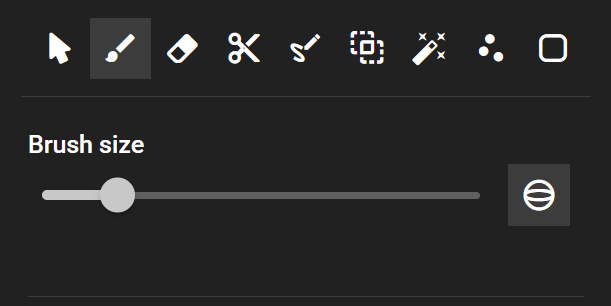

# trame-slicer


trame-slicer is a Python library bringing
[3DSlicer](https://github.com/Slicer/Slicer/) components in trame as a
composable library.

It uses 3D Slicer\'s python wrapping and adds a thin wrapping to make it
available with the [trame framework](https://github.com/Kitware/trame/).


[](https://trame-slicer.readthedocs.io/en/latest/?badge=latest)
[](https://codecov.io/gh/KitwareMedical/trame-slicer)

## Usage

The [API Reference](https://trame-slicer.readthedocs.io/en/latest/index.html)
documentation provides API-level documentation.

## Warning

The API has not been stabilized / reviewed by the 3D Slicer core developers so
please use this library with caution.

## Installing

The library can be installed in a Python environment as follows:

- Setup a Python 3.10-3.13 (included) virtualenv and activate it
- From PyPI
  - Use `pip install "trame-slicer[standalone]"` to install the latest release
- From GitHub
  - Git clone the library
  - cd into the library
  - Use the `pip install -e ".[standalone]"` command to install the library
    along it's dependencies
- For optimal performances, you should install
  [turbo-jpeg](<[url](https://github.com/Kitware/trame-rca?tab=readme-ov-file#optional-dependencies)>)

## Getting started

To get started using trame, please have a look at the
[introductory trame course](https://kitware.github.io/trame/guide/intro/course.html).

To start using the trame-slicer library, have a look and run the
[medical viewer app](https://github.com/KitwareMedical/trame-slicer/blob/main/src/trame_slicer/app/medical_viewer_app.py):

```bash
python -m trame_slicer.app.medical_viewer_app
```

## Features

The following subset of 3D Slicer features are currently supported :

### Views

- 3D view
  - Volume rendering
  - Color presets / shift
- 2D/slice view
  - Scroll/Zoom/Pan
  - Window Leveling (W/L)
  - Multiplanar Reformation (MPR)
  - Slice/slab thickness (MIP, MinIP, AvergageIP)
- Any other view types (e.g. plotly)

### Layouts

- Conventional, four-up, side-by-side
- Fullscreen mode
- Custom layouts

### I/O

- DICOM
  - MRI, CT, US, XR, PET, DWI…
- Scalar volumes
  - NRRD, NII, TIFF, HDR, IMG, MHA…
- Segmentation
  - SEG.NRRD, NRRD, SEG.NHDR, NHDR, NII, NII.GZ, HDR…
- Models/Meshes
  - OBJ, STL, VTK, VTP…
- 3D Slicer scene
  - MRML, MRB

### Segmentation tools

<p align="center">
    
</p>

- Paint: free-hand brush, 2D or 3D, varying radius
- Erase: invert paint
- Scissors: 2D or 3D sculpting
- Draw: fill the area of a drawn contour
- LogicalOperators: binary combination of segments
- Threshold: create segment based on intensity values
- Islands: keep largest, smallest… connected-components
- Smoothing: apply gaussian blur on existing segments
- Volume Intensity Masking: define a ROI with threshold where other segmentation
  tools work into
- Undo/Redo

### Markups

<p align="center">
    
</p>

- Fiducials/points
- Ruler/lines
- Angle
- Open curve/spline
- Close curve
- Plane
- ROI/box

## Work in progress

To make it easier for users to use trame-slicer, the following work are in
progress :

- Slicer wheel generation merge into 3D Slicer\'s preview release
- CI changes to build the Slicer wheel along 3D Slicer\'s release
- 3D Slicer extension to install trame-slicer and launch a trame-slicer server
  directly from 3D Slicer

## Troubleshooting

> ERROR: No matching distribution found for slicer-core

slicer-core is only supported on specific platforms, please check that your OS
and Python version are listed on
[pypi](https://pypi.org/project/slicer-core/#files)

## Contributing

Contributions are welcomed, please follow the
[CONTRIBUTING.md](https://github.com/KitwareMedical/trame-slicer/blob/main/CONTRIBUTING.md)
file for more information.

## License

The library is distributed with a permissive license. Please look at the
[LICENSE](https://github.com/KitwareMedical/trame-slicer/blob/main/LICENSE) file
for more information.

## Acknowledgments

This library was funded by the following projects :

- [Cure Overgrowth Syndromes (COSY) RHU Project (ANR-18-RHUS-005)](https://rhu-cosy.com/en/accueil-english/).
- [Handling heterogeneous Imaging and signal data for analysing the Neurodevelopmental Trajectories of premature newborns (HINT) ANR project (ANR-22-CE45-0034)](https://anr-hint.pages.in2p3.fr/)

This library was created from the
[trame-cookicutter](https://github.com/Kitware/trame-cookiecutter/) library.

## Contact

If you are interested in learning how you can use trame-slicer for your use case
in the near future, or want to get an early start using the framework, don\'t
hesitate to [contact us](https://www.kitware.eu/contact/). Or reach out in the
[issue tracker](https://github.com/KitwareMedical/trame-slicer/issues) and
[3DSlicer discourse community](https://discourse.slicer.org/).
